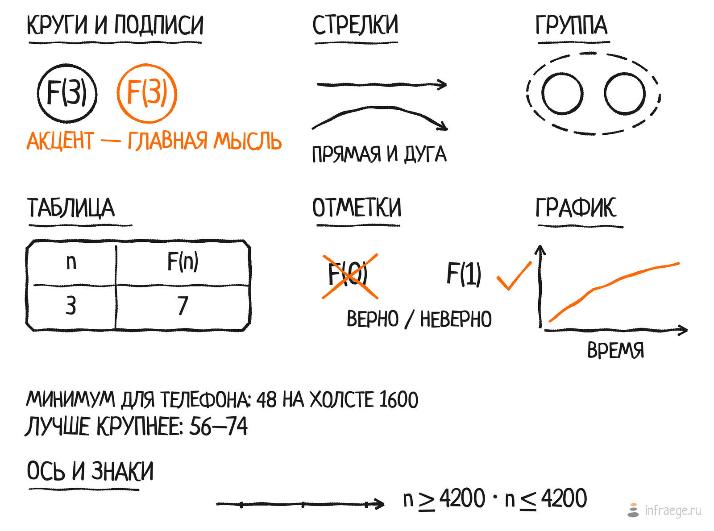

# Манера рисования

Ориентир — рисованные иллюстрации книг вроде «Грокаем алгоритмы» (Бхаргава): будто нарисовано маркером от руки. Совпадает только манера; чужие иллюстрации не копируются и не хранятся в репозитории. Образцы всех приёмов — [reference/specimen.png](reference/specimen.png), устройство — [ENGINE.md](ENGINE.md).

## Принципы

1. **Ясность.** Иллюстрация объясняет одну идею. Красота второстепенна: если ученик не понял, ролик не удался.
2. **Живая рука.** Линии неровные, с разрывами, буквы дрожат и наклонены. Это не дефект, а стиль: он добавляет динамики.
3. **Спокойствие.** Почти чёрная тушь на белом, один акцент, крупные фигуры, много воздуха.

## Линии и фигуры

- **Линия.** Тушь `#1a1a1a`, базовая толщина 6 px на холсте 1600, нажим плавно меняется вдоль штриха. Концы обрезаны с зазором до 3%. Неровность умеренная: общий множитель `WOBBLE = 0.65` (после первого просмотра убавлен на треть; полностью убирать нельзя, это фирменный стиль). Рамки, подчёркивания и дуги «ходят» слегка, а не волнами.
- **Окружности.** Одним движением: конец заходит за начало, радиус слегка «плывёт». Внутри подпись.
- **Рамки-группы.** Штриховой эллипс из штрихов разной длины, охватывает группу с запасом.
- **Стрелки.** Прямые или дугой; наконечник — два коротких неровных штриха. Дуга над рядом — «вопрос», под рядом — «ответ» (в роликах про рекурсию).
- **Таблицы и рамки.** `box` со скруглёнными углами, разделители тоньше рамки (4 px).

## Текст

- **Шрифт.** Neucha, только заглавные: широкая спокойная маркерная рука (узкий и высокий Amatic SC выглядел карикатурно). Каждая буква со своим сдвигом по высоте и наклоном до ±4°: наклон и дрожь оставлены намеренно.
- **Размеры на холсте 1600.** Минимум 48 (движок предупреждает о меньшем). Ступени: заголовок фазы 66, метка на схеме 56, значение 66, буква в круге 74. Кадр на телефоне сжимается примерно до 350 px, мельче не читается.
- **Подписи над дугами** в две строки («НУЖНО» / «F(4)»): так они крупнее и не задевают соседей.
- **Заголовки фаз** («СПРАШИВАЕМ», «ОТВЕЧАЕМ») подчёркиваются неровной чертой.
- Знаков `−`, `→`, `×` и степеней в шрифте нет: пишем `-`, `·` и слова, стрелки рисуем линиями. `≥` и `≤` движок собирает сам.

## Цвет

Один акцент `#ff6a00` (`--theme-brand-orange`) для главной мысли кадра: «дано», повтор, вывод, зачёркнуто и верно. Не декоративный. Всё остальное — тушь на белом; фон белый, потому что ролик не перекрашивается под тему. Больше одного акцента в кадре не бывает.

## Композиция

- Поля не меньше 40 px; ничего не выходит за холст (движок предупреждает).
- Крупные фигуры, воздух между ними; лишние линии и «декор» убираются.
- Заголовки фаз слева, содержимое справа; вертикально порядок «вопрос сверху, ответ снизу».
- Числа считает код, а не рисуется по памяти; они совпадают с текстом урока.

## Время

- Элементы появляются в порядке рассуждения: вызовов, вопросов, ответов. Каждой мысли — время, чтобы её прочитать.
- Ориентиры: дуга 0,7–0,8 с, подпись 0,3–0,6 с, пауза между шагами 1,2–1,4 с. Ограничения на длину нет; одна идея на ролик, две идеи — два ролика.
- В конце пауза на итоговом кадре и затухание для бесшовной петли.
- Постер — итоговый кадр: он читается без движения.

## Подпись под роликом

Одна подпись: суть идеи в одном-двух предложениях и числа из ролика. Без служебных заголовков вроде «Текстовое описание» и с минимальным отступом от видео. Ролик стоит после абзаца, который он иллюстрирует, а не после блока кода или примера. Кроме подписи есть краткое `alt` для кнопки и полосы времени.

## Вес и формат

WebM VP9 и MP4 H.264, постер WebP, ширина до 1200 px, ключевой кадр раз в 5 секунд. Вес около 300 КБ на формат — мягкий ориентир: важнее понятность.

## Чек-лист новой сцены

1. Одна идея; название и `alt` короткие.
2. Числа посчитаны кодом и сверены с текстом (`assert`).
3. Подписи ≥ 48, ничего не выходит за холст, предупреждений нет.
4. Акцент один и на главной мысли.
5. Постер читается без движения; кадры просмотрены глазами (начало, середина, итог).
6. На телефоне (350 px) подписи читаются.
7. Ролик после абзаца, подпись одна; проверены `prefers-reduced-motion`, страница без JS, перемотка.
8. `pnpm validate:content`, тесты движка, изолированный E2E.

## Статичный рисунок

- **Холст.** Ширина 1300–1600 px, высота по содержанию без пустых полей; подписи 54 и крупнее, чтобы читались на телефоне (350 px).
- **Один взгляд.** Рисунок читается слева направо и сверху вниз, заголовки частей крупные («БЕЗ КЕША», «С КЕШЕМ», «ЕСЛИ» и «ТО»). Разделитель между частями — неровная линия.
- **Акцент** отмечает главное отличие: повторы, база, вывод, зачёркнутое.
- **Сравнение «до и после»** рисуется одной и той же раскладкой в двух областях холста, чтобы различие было видно сразу.
- Подпись под рисунком — одна, с числами рисунка; в нём самом лишний текст не повторяется.
- Баланс в уроке: рисунков немного, между рисунком и роликом не меньше двух блоков.

## Знак бренда

В правом нижнем углу каждой сцены едва заметный знак: логотип (три «камня», из `apps/web/public/brand/infraege-mark.svg`) и адрес `infraege.ru`. Он служит подписью автора, а не частью объяснения:

- **Мал и светел.** Знак высотой 40 px на холсте, половинная прозрачность, адрес мелким серым `#8c8c8c` (порог читаемости на него не распространяется).
- **Отступ 26 px** от правого и нижнего краёв; содержимое не подходит ближе 14 px: движок предупреждает о пересечении. Если рисунок упирается в угол, добавьте полосу снизу или сократите подпись.
- **Не привлекает внимание:** без акцентного цвета, без анимации (в роликах знак неподвижен, в затухании белеет вместе с кадром).
- Отключается флагом `brand=False` у сцены; в уроках отключать не нужно.
